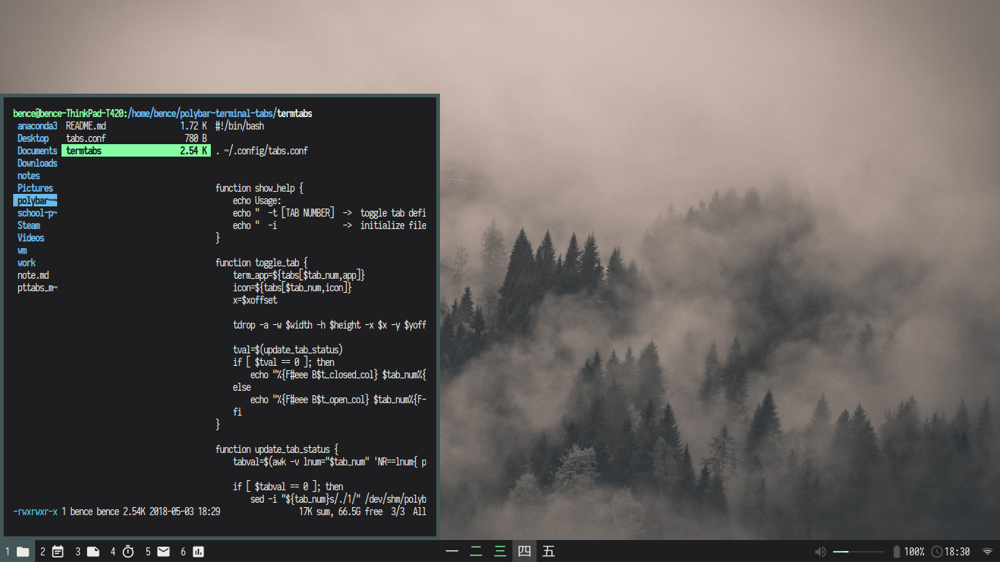

# PTTabs



**Polybar Terminal Tabs:** Some scripts to allow multiple drop-down terminals to be managed with polybar in a tab-like manner.

## Dependencies

**Required:** polybar, tdrop

**Optional:** bspwm (to make the terminals follow workspace), Google Material Design Icon Font (for default config icons to display)

## Installation

Copy `tabs.conf` to ~/.config

Copy `termtabs` to your favorite binary folder

## Configuration

Edit `tabs.conf` to set up which terminal runs which app, and set icons or text for those tabs. The comments in this file should make it clear how the configuration works.

After configuring `tabs.conf`, run the command `termtabs -g` to generate a text file that contains polybar modules to be pasted into your polybar configuration file. After this, you can add the modules to polybar like this:

```
modules-left: tab1 tab2 tab3 tab4 tab5 tab6
```

Finally, make sure to run `termtabs -i` to initialize the file which keeps track of which tabs are opened/closed. This must be run on startup, so make sure to put it into your preferred startup script.

## Polybar Configuration Requirements

The modules that control the tabs require ipc to be enabled in polybar, which can be done with:

```
enable-ipc = true
```

For the default icons to be displayed, one of your fonts in polybar should be the Material Design Icons font. For example:

```
font-0 = Iosevka Term:pixelsize=11;3
font-1 = M+ 1mn:pixelsize=15;3
font-2 = MaterialIcons:size=15:antialias=false;6
```

## Usage

The polybar modules can be clicked with the left mouse button, which will call tdrop to open that terminal and position it correctly. To bind these to keyboard shortcuts, take a look at this example sxhkd configuration:

```
super + F1
	polybar-msg hook tab1 1 
super + F2
	polybar-msg hook tab2 1 
super + F3
	polybar-msg hook tab3 1 
super + F4
	polybar-msg hook tab4 1 
super + F5
	polybar-msg hook tab5 1 
super + F6
	polybar-msg hook tab6 1 
```


